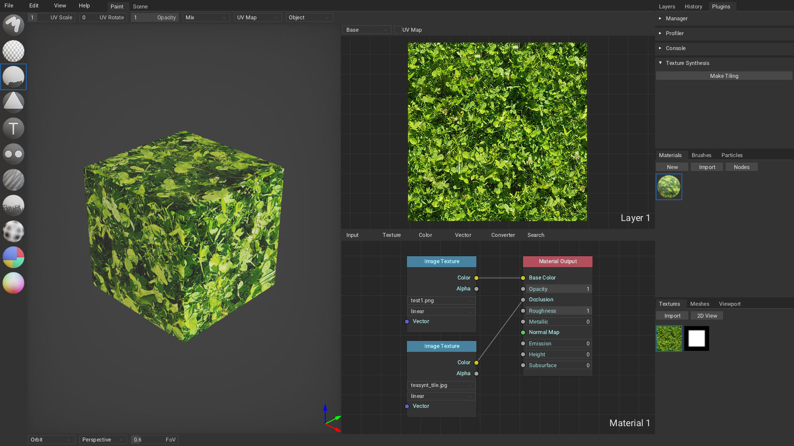

# texture-synthesis

https://github.com/EmbarkStudios/texture-synthesis

### Usage

###### Generating tiling texture:
- Clone or [download](https://github.com/armory3d/armorpaint_plugins/archive/master.zip) this repository.
- Copy files from `/plugin_texsynt` into `ArmorPaint/data/plugins`.
- Run ArmorPaint, go to `Plugins tab - Manager` and enable `texsynt` plugin.
- Open `Nodes` editor.
- `Base Color` socket is used to specify input image.
- `Occlusion` socket is used to specify borders mask. A bundled `texsynt_tile.jpg` image can be used.
- Open layer `2D View` and fill it using `Fill Tool`.
- Click `Plugins - Texture Synthesis - Make Tiling`. Depending on texture and cpu speed, this can take several minutes! Expect a speedup once rust->wasm threading is supported.
- A new tiling texture will be generated and placed in the `Textures tab`. This texture can now be used inside ArmorPaint or exported by right-clicking on the texture and clicking `Export`.



### Notes on Compiling Rust to Wasm:
- Run `cargo install wasm-pack`.
- In `Cargo.toml`:
```toml
[lib]
crate-type = ["cdylib"]

[dependencies]
wasm-bindgen = "0.2"
```
- No threading for rust->wasm yet. :( Comment out [#1](https://github.com/EmbarkStudios/texture-synthesis/blob/cd3ca527e8319072b09597ba22d32f71dec44280/lib/src/multires_stochastic_texture_synthesis.rs#L783) and [#2](https://github.com/EmbarkStudios/texture-synthesis/blob/cd3ca527e8319072b09597ba22d32f71dec44280/lib/src/multires_stochastic_texture_synthesis.rs#L785).
- `wasm-pack build` to build.
- C-like / unsafe Rust bindings prototype (do not do this, proof of concept only):
```rust
extern crate wasm_bindgen;
use wasm_bindgen::prelude::*;

// These are accessible as WebAssembly memory
static mut MEM_IMAGE: [u8; 512*512*4] = [0; 512*512*4];
static mut MEM_TILE: [u8; 512*512*4] = [0; 512*512*4];

// Retrieve WebAssembly memory address
#[wasm_bindgen]
pub fn get_image_mem() -> *const u8 { unsafe { MEM_IMAGE.as_ptr() } }

#[wasm_bindgen]
pub fn get_tile_mem() -> *const u8 { unsafe { MEM_TILE.as_ptr() } }

#[wasm_bindgen]
pub fn make_tiling() -> *const u8 {
    unsafe {
        // MEM_IMAGE and MEM_TILE is supposed to be filled with image pixels now
        let image_buffer = image::ImageBuffer::from_raw(512, 512, MEM_IMAGE.to_vec()).unwrap();
        let tile_buffer = image::ImageBuffer::from_raw(512, 512, MEM_TILE.to_vec()).unwrap();
        let image = image::DynamicImage::ImageRgba8(image_buffer);
        let tile = image::DynamicImage::ImageRgba8(tile_buffer);
        let texsynth = Session::builder()
            .inpaint_example(tile, Example::new(image))
            .resize_input(512, 512)
            .output_size(512, 512)
            .tiling_mode(true)
            .build().unwrap();
        let generated = texsynth.run(None);
        let pixels = generated.into_image().raw_pixels();
        // Perhaps copy the pixels into MEM_OUTPUT first and return MEM_OUTPUT.as_ptr()
        pixels.as_ptr()
    }
}
```
